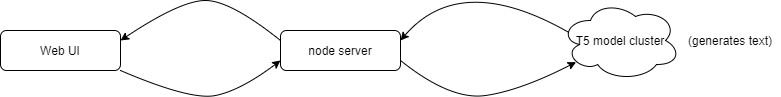

# StoryBoard Application!

currently running at [https://mike-storyboard-app.herokuapp.com/](https://mike-storyboard-app.herokuapp.com/)
**(works on mobile as well)**

## Purpose:
To create a story from a sequence of event descriptions, provided by the user. To clarify the storyboard application will attempt to generate text which transitions from one event to the next event in the user provided list as well as text that should begin and conclude the story. 

## Language Model and Data Used:

 This application generates text by using the recently released T5 ([Text-To-Text Transfer Transformer](https://github.com/google-research/text-to-text-transfer-transformer)) language model. More specifically the T5 model for this application is of size 'base' and was finetuned on the [ROCStories](https://www.cs.rochester.edu/nlp/rocstories/) dataset. More specific details of how I finetuned my own T5 model are stated in the .ipynb file.

## Diagram of application architecture:

## User Interface Description:

 - Bootstrap & JQuery were used to create the FrontEnd of the application.
 - The UI uses the NodeJS library ejs to get information back from the server.
 -  Users can download the list of event descriptions to save their work and upload that file at a later time to resume their progress.

## Deployment Details:
>The T5 model for this project was deployed to a remote kubernetes cluster which responds to HTTP POST requests by following these steps **(note this was done on a linux machine)**: 

 1. After the T5 model was finetuned to my satisfaction, it was exported to a directory which contained 2 items: a file named **saved_model.pb** and a folder named **variables**
 2. Next I installed `python3` and `pip3` using `sudo apt-get`. Then installed tensorflow and tensorflow-text using pip3.
 3. Then I installed docker using the following command:  `sudo apt install docker.io`
 4. Next I followed the steps described here: [https://www.tensorflow.org/tfx/serving/docker](https://www.tensorflow.org/tfx/serving/docker) in the first code block: 
 `docker pull tensorflow/serving`
 `git clone https://github.com/tensorflow/serving`
`docker run -t --rm -p 8501:8501 \    -v "$TESTDATA/saved_model_half_plus_two_cpu:/models/half_plus_two" \    -e MODEL_NAME=half_plus_two \    tensorflow/serving &`
`curl -d '{"instances": ["."]}' \    -X POST http://localhost:8501/v1/models/half_plus_two:predict`
	 >**Note**: I replaced the default model files located at
`/tensorflow/serving/tree/master/tensorflow_serving/servables/tensorflow/testdata/saved_model_half_plus_two_cpu/00000123` with the exported files of my finetuned model.   
Also note that the instances list in the curl command contains only one string (it did not work when I tried to have multiple strings, not sure why).
 5. Now a new docker image must be created, one that runs the T5 model by default. I created that image by following these steps: [https://www.tensorflow.org/tfx/serving/docker#creating_your_own_serving_image](https://www.tensorflow.org/tfx/serving/docker#creating_your_own_serving_image)
 6. After the new docker image has been verified to run the T5 model by default upload the new docker image to the google cloud compute engine.
 7. Create a kuberetes cluster (that will run your docker image) by: following this link [https://console.cloud.google.com/kubernetes/list](https://console.cloud.google.com/kubernetes/list), clicking +Create Cluster, and selecting the default values.
 8. Create a workload ([https://console.cloud.google.com/kubernetes/workload](https://console.cloud.google.com/kubernetes/workload)), click +Deploy, and choose existing container image then select the docker image that was uploaded in step 6.
 9. Next expose this workload as a service so it can now receive HTTP requests (when that is done correctly you will see a new service here: [https://console.cloud.google.com/kubernetes/discovery](https://console.cloud.google.com/kubernetes/discovery)) and record that service's Load balancer IP.
 10. Test that the modal is running correctly by running the same curl command in step 4, but replace the string "localhost:8501" with the Load balancer IP.
